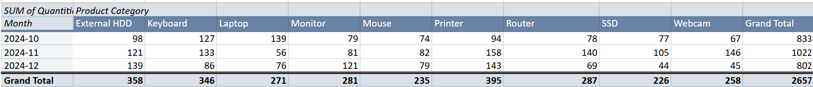

# sales-performance-gsheets-automation

**A Google Sheets automation project for sales performance tracking using Apps Script, formulas, and dashboards.**

# 📊 Sales Performance Automation Using Google Sheets & Apps Script

This project showcases a real-world **sales performance tracking and automation system** built entirely in **Google Sheets**, enhanced with **Google Apps Script**, advanced formulas, pivot tables, dashboards, and conditional logic.

The goal is to demonstrate how small to medium-sized businesses can automate performance tracking, reporting, and decision-making using tools already available in Google Workspace.

---

## 🔧 Key Features

- **Dynamic dashboards** for revenue, performance categories, and segmentation  
- **Automated categorization** of sales reps and customers  
- **Pivot tables** and **visual charts** for regional, monthly, and product-level insights  
- **Apps Script functions** for automation (e.g., data tagging, summaries)  
- **Conditional formatting** to highlight top-performing products, reps, and clients  

---

## 🗂️ Project Structure

| Folder/File         | Description                                 |
|---------------------|---------------------------------------------|
| `src/`              | Apps Script files (`.gs`) used for automation |
| `data/`             | Sample CSVs representing sales snapshots     |
| `docs/`             | Screenshots of dashboards and pivot tables   |
| `README.md`         | Project documentation                        |

---

## 🔐 Data Privacy Notice

> **Privacy Disclaimer:**  
> For privacy and confidentiality, all **client names** and **sales representative names** in this project have been **replaced with anonymized placeholders**.  
> The dataset is **synthetic and illustrative**, containing no real personally identifiable information (PII).

---

## 🚀 Use Case

This project simulates a computer shop in Kenya with:

- 500+ sales transactions  
- 5 product categories and 20+ models  
- Regional operations (e.g., Nairobi, Mombasa, Eldoret)  

It aims to automate performance tracking in areas such as:

- **Revenue contribution** by product and rep  
- **Repeat buyer detection**  
- **Regional sales segmentation**  
- **Stock forecasting** (via moving averages)  
- **Weighted ranking** for performance evaluation  

---

### 🔧 Apps Script: categorizePerformance()

Located in: `src/categorizePerformance.gs`  
This script enriches the sales data in the 'Master' sheet by adding:

- Performance Category (based on sale amount)
- Month (from Date column)
- Product Category and Product Model (from Product field)

---

## 📊 Dashboard & Visualization

After enriching the dataset using Apps Script, the `Dashboard` sheet visualizes key metrics and trends derived from the `Master` sheet.

### 🧮 Key Formulas Used

These formulas were essential in aggregating and transforming raw data into meaningful tables used throughout the dashboard:

- **`QUERY`**  
  Used to filter, group, and summarize data using SQL-like syntax. This came in handy for dynamic reporting without creating manual pivot tables.  
  _Example: Aggregate sales per region._

  ```excel
  `=QUERY(Master!C2:J, "SELECT C, SUM(I) GROUP BY C ORDER BY SUM(I) DESC", 0)`

- **`VLOOKUP / XLOOKUP`**
  Was used to fetch related information from a different table. VLOOKUP searches vertically; XLOOKUP is more flexible and modern, handling both directions.
  _Example: Retrieve a product category using its name._
  
- **`SUM / SUMIF`**
  SUM adds values across a range. SUMIF adds conditionally, such as summing only sales from a specific region or month.
  _Example: Add up the number of units sold in Nairobi_
  
  ```excel
    `=SUMIF('Master Copy'!C2:C, "Nairobi", 'Master Copy'!G2:G)`

- **`COUNT / COUNTIF`**
  COUNT returns the number of numeric entries. COUNTIF returns the count of entries matching a condition.
  _Example: Count all completed transactions._
  
  ```excel
    =COUNTIF('Master Copy'!J:J, "Completed")`**

- **`AVERAGE / AVERAGEIF`**
  Returns the mean of selected numbers. Useful for metrics like average order value or average monthly revenue.
  _Example: Calculate average sale amount._

  ```excel
    =AVERAGEIF('Master Copy'!I1:I, "<>")

### 📌 Summary Metrics (Live Data)

| **Metric**               | **Value**            |
|--------------------------|----------------------|
| **Total Sales (KES)**    | 47,957,516.00        |
| **No. of Transactions**  | 500                  |
| **No. of Units Sold**    | 2,657                |
| **Avg Order Value (KES)**| 95,915.03            |


---

### 📍 Visualization 1: Amount of Sales per Region

This bar chart visualizes the total sales revenue generated across different sales regions.

#### 📊 Sample Data Summary:

| Region     | Sales (KES)       |
|------------|-------------------|
| Nairobi    | 9,087,326.00      |
| Eldoret    | 8,912,671.00      |
| Mombasa    | 8,668,383.00      |
| Kisumu     | 6,903,473.00      |
| Nakuru     | 5,513,168.00      |
| Machakos   | 5,116,582.00      |
| Thika      | 3,755,913.00      |

#### 🔍 How It Was Built

- The chart uses a `QUERY` formula to aggregate sales data from the `Master Copy` sheet:
  ```excel
  =QUERY(Master!C2:J, "SELECT C, SUM(I) GROUP BY C ORDER BY SUM(I) DESC LABEL C 'Region', SUM (I) 'Sales (KES)'", 0)
  
#### 📊 Visualizations
This was visualized using both a bar chart and a pie chart to provide complementary perspectives:

- The bar chart offers a clear comparison of absolute sales figures across different regions, making it easy to identify high- and low-performing areas.

- The pie chart highlights each region’s proportional contribution to the total sales, offering a quick glance at regional distribution.
  


#### 🧠 Insight
> Nairobi, Eldoret, and Mombasa are the top three revenue-generating regions, contributing over 55% of total sales combined.
This highlights the importance of sustaining operations and promotional focus in these key urban hubs.
Regions like Thika and Machakos show growth potential and may benefit from targeted engagement strategies.
---

### 📍 Visualization 2: Amount of Sales (KES) by Month of the Year

In the next chart, we track sales performance over time by month, helping to visualize seasonality or trends in revenue flow.

#### 📊 Sales by Month

| Month     | Sales (KES)       |
|-----------|-------------------|
| 2024-10   | 18,100,657.00     |
| 2024-11   | 15,215,057.00     |
| 2024-12   | 14,641,802.00     |

#### 🔍 How It Was Built

- Data was queried from the `Master Copy` using:
  ```excel
  =QUERY('Master Copy'!A2:J, "SELECT L, SUM(J) GROUP BY L ORDER BY L ASC LABEL L 'Month', SUM(J) 'Sales (KES)'", 0)


#### 📊 Visualization
This was best visualized using a line chart, which effectively captures trends and fluctuations in monthly sales. It's ideal for spotting peaks, drops, and seasonal patterns over time.


  
#### 🧠 Insight

> Sales peaked in **October 2024** and declined gradually through November and December — which reflects a front-loaded promotion cycle and stock availability trends. This will help plan stock reordering and marketing campaigns more effectively.

---

### 📍 Visualization 3: Sales by Product Category

This chart visualizes the total revenue generated by each product category, helping identify which types of products drive the most sales.

#### 📊 Sales by Category

| Product       | Amount (KES)       |
|---------------|--------------------|
| Laptop        | 20,320,261.00      |
| Printer       | 7,669,114.00       |
| Monitor       | 6,855,053.00       |
| External HDD  | 3,645,817.00       |
| Router        | 2,935,163.00       |
| SSD           | 2,525,949.00       |
| Webcam        | 2,193,328.00       |
| Keyboard      | 1,294,212.00       |
| Mouse         | 518,619.00         |

#### 📊 Visualizations

- **Bar Chart**: Shows actual sales per category for easy comparison.
- **Donut Chart**: Illustrates percentage share of total sales.


  #### 🧠 Insight
  
  > Laptops alone contribute over 42% of the total sales — significantly outpacing all other categories. This will guide our inventory prioritization, pricing strategies, and promotion focus. Printers and Monitors follow as the next key revenue contributors.

---

### 📍 Visualization 4: Units Purchased per Product Category

This visualization highlights which product categories are sold most frequently — offering insights into customer preferences, product popularity, and high-turnover stock.

#### 📊 Units Sold by Category

| Product Category | Units Purchased |
|------------------|-----------------|
| Printer          | 395             |
| External HDD     | 358             |
| Keyboard         | 346             |
| Router           | 287             |
| Monitor          | 281             |
| Laptop           | 271             |
| Webcam           | 258             |
| Mouse            | 235             |
| SSD              | 226             |

#### 📊 Visualizations

- **Column Chart**: Clear comparison of unit sales across categories
- **Pie Chart**: Percentage contribution of each category to overall sales volume


#### 🧠 Insight

> **Printers**, **HDDs**, and **Keyboards** lead in units sold, despite not topping revenue charts. These high-frequency purchases represents essential or everyday items. In contrast, Laptops, while highest in revenue, are middle-ranked in unit sales — reinforcing their high-value, low-volume nature. This suggests opportunities to optimize inventory around volume leaders for consistent cash flow and premium products for margin.

---

### 📍 Visualization 5: Amount of Sales per Sales Person

This chart presents a direct comparison of the total sales generated by each sales representative. A Rank column is included for future weighted performance scoring and leaderboard use.

#### 📊 Total Sales by Rep

| Sales Person     | Sales (KES)     | Rank |
|------------------|-----------------|------|
| James Turner     | 6,384,304.00    | 1    |
| Mark Howell      | 6,353,176.00    | 2    |
| Sherry Chen      | 5,718,030.00    | 3    |
| Amanda Frank     | 5,149,953.00    | 4    |
| Gregory Jones    | 4,550,213.00    | 5    |
| Isaac Foley      | 4,321,945.00    | 6    |
| Courtney Smith   | 4,152,927.00    | 7    |
| Jeremy Allison   | 4,118,345.00    | 8    |
| Francis Park     | 3,766,475.00    | 9    |
| Nathan West      | 3,442,148.00    | 10   |

#### 📊 Visualization

- **Column chart**: Used to show total sales volume per person
- The data is sorted by total sales in descending order


#### 🧠 Insight

> **James Turner** and **Mark Howell** significantly outperform the rest of the team in revenue generated, with over KES 6M each in sales. While rep performance naturally varies, this gap suggests the need to study high-performers' strategies for possible team-wide replication. The *Rank* column will be used in future leaderboard visualizations to combine both sales volume and transaction count for a more holistic performance assessment.

---

### 📍 Visualization 6: Number of Sales per Sales Person

This chart highlights how active each sales representative was, based on how many transactions they handled. It's useful for identifying reps who may be high-effort but not necessarily high-revenue, or vice versa.

#### 📊 Sales Activity by Rep

| Sales Person     | No. of Sales | Rank |
|------------------|--------------|------|
| James Turner     | 396.00       | 1    |
| Amanda Frank     | 304.00       | 2    |
| Courtney Smith   | 288.00       | 3    |
| Mark Howell      | 279.00       | 4    |
| Nathan West      | 269.00       | 5    |
| Jeremy Allison   | 246.00       | 6    |
| Sherry Chen      | 243.00       | 7    |
| Gregory Jones    | 216.00       | 8    |
| Francis Park     | 209.00       | 9    |
| Isaac Foley      | 207.00       | 10   |

#### 📊 Visualization

A **bar chart** was used to clearly show reps ranked by transaction count.


#### 🧠 Insight
> **James Turner** leads not only in revenue but also in the number of transactions — reinforcing his consistent high performance. However, reps like **Amanda Frank** and **Courtney Smith** also show high engagement despite slightly lower total sales, which may indicate they handle more lower-value transactions. These insights will later feed into a weighted ranking system to balance both volume and value.

---

### 📍 Visualization 7: Weighted Sales Rep Leaderboard

After seeing how each saleperson perfom in both revenue and units sold, how about we create a leaderboard that combines both revenue performance and transactional volume to rank them more fairly and holistically.

#### 🧮 Weighted Rank Logic

To create a balanced ranking system:
- **Sales Amount Rank** (based on total revenue) was weighted at 60%
- **Sales Number Rank** (based on total transactions) was weighted at 40%
- The formula weighs revenue (60%) more heavily but still values transaction volume (40%).

However, since lower ranks are better (1 = best), directly plotting them on a bar chart would show *smaller bars* for top performers — which is unintuitive.
To fix this, a **Chart Score** was calculated to invert the ranks for charting:
  - Chart Score = 10 – Weighted Rank

#### 🧑‍💼 Weighted Leaderboard Data

| Sales Person     | Sales Amt. Rank | Sales No. Rank | Weighted Rank | Chart Score |
|------------------|------------------|----------------|----------------|-------------|
| James Turner     | 1                | 1              | 1.0            | 9.0         |
| Mark Howell      | 2                | 4              | 2.8            | 7.2         |
| Amanda Frank     | 4                | 2              | 3.2            | 6.8         |
| Sherry Chen      | 3                | 7              | 4.6            | 5.4         |
| Courtney Smith   | 7                | 3              | 5.4            | 4.6         |
| Gregory Jones    | 5                | 8              | 6.2            | 3.8         |
| Jeremy Allison   | 8                | 6              | 7.2            | 2.8         |
| Isaac Foley      | 6                | 10             | 7.6            | 2.4         |
| Nathan West      | 10               | 5              | 8.0            | 2.0         |
| Francis Park     | 9                | 9              | 9.0            | 1.0         |

#### 📊 Visualization

- A **bar chart** was created using `Chart Score` to represent the weighted performance visually.


#### 🧠 Insight
> The weighted leaderboard reveals that **James Turner** is not only the top seller but also the most active, making him the clear overall leader. **Mark Howell** and **Amanda Frank** balance high transaction counts and sales, placing just behind. Meanwhile, some reps with strong individual metrics (like Sherry Chen’s revenue or Courtney Smith’s volume) rank lower overall due to imbalance. This view encourages coaching and training based on both effort and effectiveness.

---

### 📍 Visualization 8: Top 3 Regional Sales by Product Category

This chart visualizes how different product categories performed across the top 3 regional markets — **Nairobi**, **Mombasa**, and **Eldoret**. It helps identify product strengths by location and supports regional inventory or marketing strategies.

#### 📊 Regional Product Sales Data (Sample)

| Region   | Product       | Total Sales (KES) |
|----------|---------------|-------------------|
| Nairobi  | Mouse         | 73,328.00         |
| Nairobi  | Keyboard      | 92,726.00         |
| Mombasa  | Keyboard      | 204,497.00        |
| Eldoret  | Router        | 326,103.00        |
| Nairobi  | Laptop        | 5,168,552.00      |
| Mombasa  | Laptop        | 3,699,525.00      |
| Eldoret  | Laptop        | 4,144,507.00      |
| ...      | ...           | ...               |

#### 🔄 Pivot Table Summary

The raw data was transformed into a pivot table with:
- **Rows**: Region
- **Columns**: Product Category
- **Values**: Sum of Total Sales (KES)


#### 📊 Visualization

- A **stacked column chart** was created to show how each product contributes to regional totals.
- Each **region** is on the X-axis, and **sales in KES** on Y-axis, with product categories forming different colored segments.


#### 🧠 Insight
> **Laptops** dominate in all the top three regions, with Nairobi leading in total laptop sales. However, Eldoret performs exceptionally well in diversified categories such as Printers, Webcams, and Monitors, making it a well-rounded sales region. Mombasa stands out for high Monitor and External HDD sales. This insight will guide location-specific promotions, stock levels, and regional sales targets.

---

### 📍 Visualization 9: Product Sales Quantities by Month

This visualization explores how many units of each product category were sold across the final quarter of 2024. By examining month-over-month trends, we can identify **seasonal spikes**, **declining products**, or **inventory pressure points**.

#### 📄 Raw Quantity Data (Sample)

| Product Category | Month     | Quantities Sold |
|------------------|-----------|------------------|
| External HDD     | 2024-10   | 98               |
| Keyboard         | 2024-10   | 127              |
| Laptop           | 2024-10   | 139              |
| Monitor          | 2024-11   | 81               |
| Webcam           | 2024-11   | 146              |
| SSD              | 2024-12   | 44               |
| ...              | ...       | ...              |

#### 🔄 Pivot Table Summary

A pivot table was generated with:
- **Rows**: Product Category  
- **Columns**: Month  
- **Values**: Sum of Quantities Sold



#### 📊 Visualization
A multi-series line chart was created from the pivot table

Each line represents a product category, showing sales trends from October to December 2024


#### 🧠 Insight
> The data reveals several trends:
>
> - **Printers** and **Webcams** peak in November, possibly due to promotional activity or seasonal demand.
>
> - **Laptops** see a strong October but dip in November and somehow stabilize in December — suggesting front-loaded Q4 demand. Since Laptops are our high revenue generating products, this dip explains why there was a drop in overall sales in November and December.
>
> - **External HDDs** and **Monitors** steadily increase, showing potential growing demand.

  ---

### 📍 Visualization 10: Laptop Revenues Per Region

Given that **Laptops account for over 42% of total company revenue**, a deeper look into **regional laptop sales** reveals where this demand is strongest — guiding future regional strategies for inventory, promotions, and salesforce alignment.

#### 💻 Regional Laptop Revenue Data

| Region    | Laptop Revenues (KES) | Percentage   |
|-----------|------------------------|--------------|
| Nairobi   | 1,012,093.00           | 25.41%       |
| Mombasa   | 796,102.00             | 19.99%       |
| Eldoret   | 709,284.00             | 17.81%       |
| Nakuru    | 527,580.00             | 13.25%       |
| Kisumu    | 470,791.00             | 11.82%       |
| Machakos  | 272,097.00             | 6.83%        |
| Thika     | 194,941.00             | 4.89%        |

#### 📊 Visualization

A **bar chart** and **donut chart** were used to show both absolute revenue and percentage contribution by region.


#### 🧠 Insight
> **Nairobi** leads in laptop revenue, accounting for over 25% of total category sales. **Mombasa** and **Eldoret** follow closely, indicating strong secondary markets. Combined, the top 3 regions contribute over 60% of all laptop sales, suggesting these should be priority targets for premium stock allocation, tech product promotions, or sales incentives.
> 
> Conversely, regions like Thika and Machakos, though lower in revenue, may present growth opportunities if targeted campaigns are introduced.

---

### 📍 Visualization 11: Laptop Revenue by Sales Representative

As laptops remain our highest-grossing product category, it's essential to understand which members of the sales team are driving this performance. This breakdown helps identify top contributors, potential mentorship opportunities, and areas to focus performance incentives.

#### 👩‍💼 Sales Rep Laptop Revenue Data

| Sales Rep       | Laptop Revenues (KES) | Percentage |
|------------------|------------------------|------------|
| Sherry Chen      | 677,772.00             | 17.02%     |
| Mark Howell      | 623,724.00             | 15.66%     |
| Gregory Jones    | 517,284.00             | 12.99%     |
| James Turner     | 454,793.00             | 11.42%     |
| Isaac Foley      | 425,686.00             | 10.69%     |
| Courtney Smith   | 408,406.00             | 10.25%     |
| Francis Park     | 283,126.00             | 7.11%      |
| Amanda Frank     | 259,342.00             | 6.51%      |
| Jeremy Allison   | 249,935.00             | 6.28%      |
| Nathan West      | 82,820.00              | 2.08%      |

#### 📊 Visualization

Two charts were used to illustrate this:

- **Column Chart**: Highlights the absolute performance of each rep.
- **Donut Chart**: Shows each rep’s contribution as a percentage of total laptop sales.


#### 🧠 Insight
> **Sherry Chen** and **Mark Howell** lead the laptop category, contributing over 32% of total laptop revenue combined. **Gregory Jones** and **James Turner** also show strong performance. Reps with lower contribution (e.g., **Nathan West**) may benefit from training or cross-selling strategies to improve sales in this key category.
> With these insights we can form bonus structures, sales recognition, and training plans aligned specifically with high-value product lines.

---

### 📍 Visualization 12: Laptop Revenue by Model

To optimize procurement and marketing strategies within our most profitable category, it’s crucial to identify **which laptop models** contribute the most to revenue. This model-level view supports **SKU-level decisions**, **pricing strategy**, and **inventory prioritization**.

#### 💻 Laptop Model Sales Breakdown

| Laptop Model        | Total Sales (KES) | % of Laptop Revenue | % of Total Revenue |
|---------------------|-------------------|---------------------|---------------------|
| Dell Inspiron       | 7,316,600         | 36.01%              | 15.26%              |
| HP Pavilion         | 5,308,217         | 26.12%              | 11.07%              |
| Lenovo Ideapad      | 3,393,923         | 16.70%              | 7.08%               |
| HP Elitebook        | 2,313,776         | 11.39%              | 4.82%               |
| Lenovo ThinkPad X1  | 1,987,745         | 9.78%               | 4.14%               |

#### 📊 Visualization

- **Column Chart**: Compares absolute sales per model.
- **Donut Chart**: Shows model’s % contribution to total laptop revenue.


### 🧠 Insight

> The laptop segment reveals a **high revenue concentration among a few models**:
> 
> - **Dell Inspiron alone contributes over 36% of laptop product revenue** and more than **15% of total company revenue**, making it not only our top-selling model but also a key driver of business success. *Its consistent performance suggests strong market preference and brand trust.* It is also important to note that it is an indication of heavy reliance on a single model which poses a potential risk if demand for this model declines or supply is disrupted.
>   
> - **HP Pavilion** follows with **26.12%**, bringing the combined share of the top two models to **over 62%** — an indication of where customer demand is focused.
>   
> - **Lenovo Ideapad**, **HP Elitebook**, and **Lenovo ThinkPad X1** round out the lineup, showing potential for strategic marketing or bundling to increase share.
>   
> - While reliance on a few models presents a **concentration risk**, the performance of Dell Inspiron provides a **solid foundation for revenue stability**.  
  📌 *This also opens room to explore complementary accessories or services tailored to Dell users.*

---

### 📍 Visualization 13: Top 20 Clients by Revenue Contribution

Understanding who our top clients are helps us prioritize **relationship management**, develop **loyalty initiatives**, and allocate **support resources** more effectively. This breakdown ranks the 20 clients who contributed the most to overall sales revenue.

#### 🧾 Client Revenue Data (Top 10 shown)

| Client                    | Amount Of Purchases (KES) | % Of Total Revenue |
|---------------------------|----------------------------|--------------------|
| Hutchinson Group          | 2,492,060.00               | 5.20%              |
| Martin-Bell               | 2,005,623.00               | 4.18%              |
| Martin Group              | 1,845,837.00               | 3.85%              |
| Johnson-Massey            | 1,843,907.00               | 3.84%              |
| Solomon Inc               | 1,842,199.00               | 3.84%              |
| Luna Ltd                  | 1,790,022.00               | 3.73%              |
| Ramirez, Gay and Clayton | 1,774,132.00                | 3.70%              |
| Wolfe-Rodriguez           | 1,713,312.00               | 3.57%              |
| Baker-Davenport           | 1,610,210.00               | 3.36%              |
| Eaton Ltd                 | 1,549,631.00               | 3.23%              |

#### 📊 Visualization

A **horizontal bar chart** was created to clearly illustrate how much each client contributes to overall revenue.


#### 🧠 Insight
> The top 10 clients account for nearly 40% of total revenue, with **Hutchinson Group** alone contributing over 5%. This indicates a high level of revenue concentration — these clients represent key accounts that should receive dedicated relationship management, custom offers, or retention-focused strategies.
> 
> The data also helps uncover potential risk — if any of these top clients reduce spending or churn, the business impact could be significant. Diversifying the client base while nurturing these top contributors will help maintain both stability and growth.

---

### 📍 Visualization 14: Top 20 Clients by Number of Visits

While revenue tells us who spends the most, visit frequency reveals **client engagement intensity** — which clients are most consistently interacted with, either for purchases, support, or relationship building.

#### 🧾 Client Visit Frequency (Top 15 Shown)

| Client                       | No. of Visits |
|------------------------------|----------------|
| Hutchinson Group             | 19             |
| Lopez, Green and Todd        | 19             |
| Ramirez, Gay and Clayton     | 17             |
| Luna Ltd                     | 16             |
| Stein-Eaton                  | 16             |
| Bradford Inc                 | 15             |
| Palmer, Morgan and Pitts     | 15             |
| Baker-Davenport              | 14             |
| Martin-Bell                  | 14             |
| Mccormick and Sons           | 14             |
| Solomon Inc                  | 14             |
| Spears-Rose                  | 14             |
| Taylor-Small                 | 14             |
| Foster, James and Mahoney    | 13             |
| Hicks, Lawson and Pierce     | 13             |

#### 📊 Visualization

A **vertical bar chart** was used to show client names versus their number of visits for easy comparison.


#### 🧠 Insight
> **Hutchinson Group** and **Lopez, Green and Todd** top the list with 19 visits each, closely followed by others with 14–17 interactions. These frequent touchpoints may indicate strong ongoing relationships or possibly high service needs.
>
> When compared to revenue contributions, some of these clients may be high-touch but low-yield, suggesting a need to optimize support efforts or evaluate client profitability. Others, like Hutchinson Group, appear in both lists — marking them as strategic accounts worth further investment.

---

### 📍 Visualization 15: Top 20 Clients by Units Purchased

While revenue shows value and visits indicate engagement, **units purchased** gives a view into **client volume behavior** — critical for analyzing logistics, fulfillment, and forecasting.

#### 📦 Top Clients by Quantity (Top 16 Shown)

| Client                         | Units Purchased | % of Total Units |
|--------------------------------|------------------|------------------|
| Hutchinson Group               | 119              | 4.48%            |
| Bradford Inc                   | 83               | 3.12%            |
| Johnson-Massey                 | 82               | 3.09%            |
| Stein-Eaton                    | 82               | 3.09%            |
| Luna Ltd                       | 81               | 3.05%            |
| Anderson, Miles and Robinson   | 80               | 3.01%            |
| Martin Group                   | 80               | 3.01%            |
| Mccormick and Sons             | 80               | 3.01%            |
| Lopez, Green and Todd          | 79               | 2.97%            |
| Solomon Inc                    | 78               | 2.94%            |
| Martin-Bell                    | 77               | 2.90%            |
| Spears-Rose                    | 77               | 2.90%            |
| Cox-Allen                      | 75               | 2.82%            |
| Haynes, Armstrong and Contreras| 74               | 2.79%            |
| Hicks, Lawson and Pierce       | 74               | 2.79%            |
| Palmer, Morgan and Pitts       | 72               | 2.71%            |

#### 📊 Visualization

This was best visualized using a **bar chart** to compare unit volume across the top clients.


#### 🧠 Insight
> **Hutchinson Group** not only tops revenue and visits but also leads in volume — making them your most valuable client across multiple dimensions. Others like **Bradford Inc** and **Stein-Eaton** show strong volume presence despite not topping the revenue chart, hinting at price-sensitive or bulk purchasing behavior.
>
>This data supports logistics planning, volume discount negotiations, and helps identify clients for wholesale strategies or product upsell opportunities.

---

### 📍 Visualization 16: Client Performance Scoring Summary

This table introduces a **client performance index** — a strategic metric that combines key client behaviors into a single **weighted score**, normalized on a 0–1 scale for comparability.

#### 🧮 Metrics Considered

- **Amount Of Purchases (KES)** – Measures total revenue contribution.
- **Units Purchased** – Indicates order volume and inventory draw.
- **Number of Visits** – Reflects engagement or frequency.

Each metric was **normalized** using the formula:

  *`Normalized Value = (Client Value – Min Value) / (Max Value – Min Value)`*

Then a **weighted score** was computed using:

  *`Weighted Score = 0.4 * Norm. Amount + 0.3 * Norm. Units + 0.3 * Norm. Visits`*
  
  _Weights can be adjusted based on business focus but in this case, revenue was slightly prioritized_

> 🧾 **Note:** Table below is a trimmed version for visual purposes.  
> 📄 > *For full table, see:* [`helper_table.png`](docs/client_ranking_weighted_table.png)

| Client                 | Purchases (KES) | Units | Visits | Weighted Score |
| ---------------------- | --------------: | ----: | -----: | -------------- |
| **Hutchinson Group**   |    2,492,060.00 |   119 |     19 | **1.000**      |
| **Martin-Bell**        |    2,005,623.00 |    77 |     14 | 0.663          |
| **Martin Group**       |    1,845,837.00 |    80 |     12 | 0.607          |
| **Solomon Inc**        |    1,842,199.00 |    78 |     14 | 0.630          |
| **Luna Ltd**           |    1,790,022.00 |    81 |     16 | 0.659          |
| *...*                  |           *...* |   ... |    ... | ...            |
| **Hernandez and Sons** |      329,918.00 |    43 |      8 | 0.070          |
| **Espinoza Group**     |      282,164.00 |    35 |      6 | **0.000**      |


#### 🧠 Insight
> **Hutchinson Group** leads with a perfect score of 1, topping all three individual metrics. Others like **Martin-Bell**, **Luna Ltd**, and **Solomon Inc** also consistently rank high across revenue, volume, and engagement — identifying them as prime candidates for loyalty programs, tailored offers, or early access to new product lines.


### 🧮 Client Segmentation Helper Table

The table below was used to segment clients based on their weighted performance score (derived from purchases, units, and visits). This segmentation powers several later visualizations and strategies.

> *For full table, see:* [`helper_table.png`](docs/client_ranking_helper_table.png)

| Client                   | Weighted Score | Customer Segment    |
|--------------------------|----------------|----------------------|
| Hutchinson Group         | 1.00           | VIP                  |
| Martin-Bell              | 0.66           | VIP                  |
| ...                      | ...            | ...                  |
| Davidson-Murphy          | 0.13           | Low Engagement       |
| Hernandez and Sons       | 0.07           | Low Engagement       |
| Espinoza Group           | 0.00           | Low Engagement       |


### 🍩 Visualization 17 : Count Per Customer Segment
This donut chart provides a high-level summary of how clients are distributed across defined performance segments based on weighted scoring (from purchases, units, and visits). These categories help tailor engagement strategies by identifying VIPs, Loyal Customers, and those requiring attention.

| Segment              | Client Count |
| -------------------- | ------------ |
| Loyal Customers      | 17           |
| Growth Opportunities | 10           |
| Occasional Buyers    | 6            |
| Low Engagement       | 4            |
| VIP                  | 3            |


#### 🧠 Insight
> Most clients fall under **Loyal Customers** and **Growth Opportunities**, suggesting a strong middle-tier base that could be nurtured into VIPs. However, the Low Engagement group (4 clients) represents churn risk and should be flagged for re-engagement.

### 📊 Visualization 18: Top 20 Revenue-Generating Product Models
This visualization showcases the top 20 individual product models that contributed the highest revenue across all transactions. It's helpful for identifying top performers that should be prioritized in procurement, promotion, and stock planning.

**Table Preview (Trimmed)**
| Product Model      | Revenue Contribution (KES) | % of Total Revenue |
| ------------------ | -------------------------- | ------------------ |
| Dell Inspiron      | 7,316,600.00               | 15.26%             |
| HP Pavilion        | 5,308,217.00               | 11.07%             |
| Lenovo Ideapad     | 3,393,923.00               | 7.08%              |
| HP Elitebook       | 2,313,776.00               | 4.82%              |
| Samsung Xpress     | 2,295,424.00               | 4.79%              |
| Epson EcoTank      | 2,072,849.00               | 4.32%              |
| HP 27"             | 2,039,775.00               | 4.25%              |
| Lenovo ThinkPad X1 | 1,987,745.00               | 4.14%              |
| Dell UltraSharp    | 1,674,454.00               | 3.49%              |
| Canon Pixma        | 1,296,447.00               | 2.70%              |


#### 🧠 Insight
> The **Dell Inspiron** leads with over 15% of total revenue, followed closely by **HP Pavilion** and **Lenovo Ideapad**. This concentration of revenue within a few models suggests that a focused strategy around these products can significantly impact overall sales performance.
> 
>While this dominance presents an opportunity to maximize returns through focused marketing and inventory strategies, it also introduces risk — overdependence on a single model could impact revenue stability if availability or market preference shifts unexpectedly.


